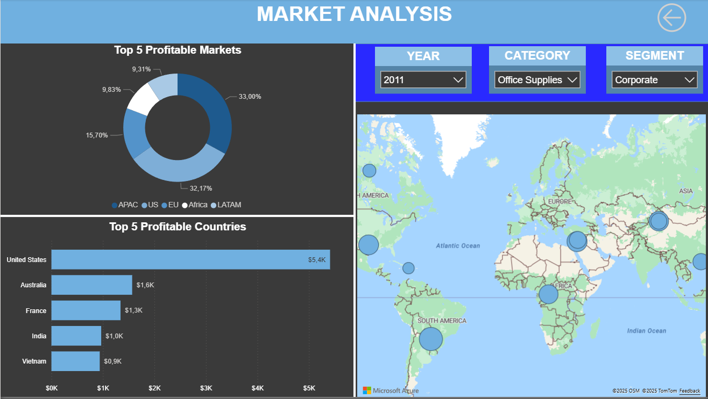
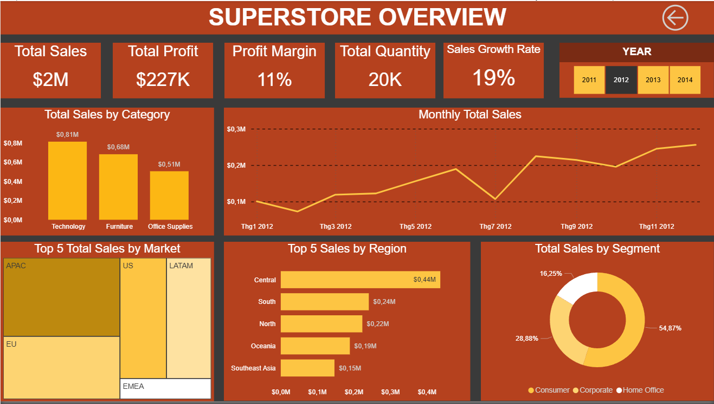
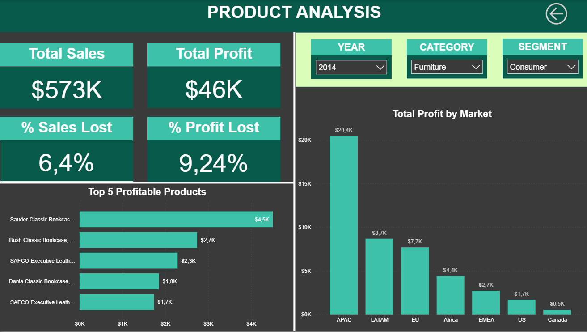

# Strategic Superstore Sales & Profitability Dashboard

## Project Overview
The **Strategic Superstore Sales & Profitability Dashboard** is designed to empower senior management with actionable insights into sales, profitability, and market performance. By visualizing key business drivers, the dashboard supports **strategic decisions** around market expansion, product portfolio optimization, and customer segmentation.

---

## Live Dashboard / Screenshots
Below are the key views from the Power BI dashboard:  

### 1. Market Analysis


### 2. Superstore Overview


### 3. Product Analysis


*Tip: Replace with a [Power BI Service link](https://app.powerbi.com/) if publishing online.*

---

## Business Problem
Senior leaders need a clear, data-driven understanding of where the business is excelling and where improvements are necessary. Traditional reports often lack interactivity and strategic focus.  
This dashboard addresses the following key questions:

- **Which regions and sub-regions deliver the highest profitability and growth potential?**  
- **Which product categories and sub-categories are driving sales vs. profitability?**  
- **Where are sales or profits lagging, and what are the contributing factors?**  
- **How are performance metrics trending over time (Year-over-Year)?**

---

## Key Features & Analysis
- **Executive Summary:**  
  High-level KPIs including Total Sales, Total Profit, Profit Margin, Quantity Sold, and YoY Growth Rate.
  
- **Geographical Analysis:**  
  Interactive maps and region breakdowns to highlight top-performing and underperforming areas.
  
- **Product Performance:**  
  Sales and profitability by **Category** (Technology, Furniture, Office Supplies) and **Sub-Category**.
  
- **Customer Segment Insights:**  
  Comparative analysis of **Consumer**, **Corporate**, and **Home Office** segments.  

- **Trend Analysis:**  
  Time-series visualizations to track sales and profit trends across multiple years.

---

## Technical Details & Skills Demonstrated
- **Tool:** Microsoft **Power BI**  
- **Data Source:** [Superstore Dataset on Kaggle](https://www.kaggle.com/datasets/vivek468/superstore-dataset-final)  
- **Data Cleaning & Transformation:**  
  Used **Power Query** for handling missing values, correcting data types, and building calculated columns.  
- **Data Modeling:**  
  Implemented a **star schema** for efficient performance and intuitive relationships between sales, products, and customer dimensions.  
- **DAX Measures:**  
  Developed custom **DAX** calculations to evaluate profitability, losses, and year-over-year growth.

---

## Key DAX Measures Implemented
- **% Profit Lost:**  
  Calculates the percentage of potential profit lost due to discounts or other inefficiencies.  
  *Formula Concept:* `(Profit Lost / Total Potential Profit) * 100`

- **% Sales Lost:**  
  Highlights the percentage of sales opportunities lost due to returns, discounts, or stockouts.  
  *Formula Concept:* `(Sales Lost / Total Potential Sales) * 100`

- **Sales YoY %:**  
  Measures **year-over-year sales growth** to evaluate performance momentum.  
  *Formula Concept:* `((Sales Current Year - Sales Previous Year) / Sales Previous Year) * 100`

---

## How to Use This Repository
1. Clone the repository:
   ```bash
   git clone https://github.com/<your-username>/<repo-name>.git
